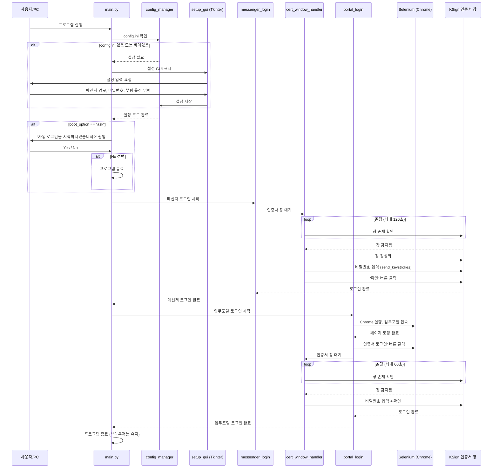
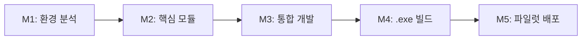

# PRD: GEN2020 메신저 및 교육청 업무포털 자동 로그인 프로그램

---

## 1. 문서 개요

| 항목 | 내용 |
|------|------|
| 문서 제목 | GEN2020 메신저 및 교육청 업무포털 자동 로그인 프로그램 PRD |
| 문서 버전 | v1.0 |
| 최초 작성일 | 2026-03-06 |
| 최종 수정일 | 2026-03-06 |
| 작성자 | DASA (Desktop Automation Solution Architect) |
| 검토자 | (TBD) |
| 승인 상태 | 초안 (Draft) |

### 문서 이력

| 버전 | 날짜 | 작성자 | 변경 내용 |
|------|------|--------|-----------|
| v1.0 | 2026-03-06 | DASA | 최초 작성 |

---

## 2. 제품/솔루션 개요

### 2.1 배경 및 문제 정의

교육청 소속 교사 및 직원은 매일 업무 시작 시 다음 두 가지 시스템에 수동으로 로그인해야 한다.

1. **GEN2020 메신저**: PC 부팅 시 자동 실행되며, KSign 인증서 선택 창에서 비밀번호를 입력하여 로그인
2. **교육청 업무포털(gen.eduptl.kr)**: 웹 브라우저를 열고 접속한 뒤, 전자서명 인증서 로그인 버튼 클릭 후 다시 인증서 비밀번호를 입력하여 로그인

이 과정은 매일 반복되며, 인증서 비밀번호를 두 번 수동 입력해야 하는 번거로움이 있다. 특히 비개발자인 교직원에게는 부팅 직후 여러 창이 뜨는 과정에서 타이밍을 놓치거나 실수할 가능성이 존재한다.

### 2.2 비즈니스 목표 및 KPI

| 목표 | KPI | 목표치 |
|------|-----|--------|
| 로그인 자동화로 업무 시작 시간 단축 | 로그인 완료까지 소요 시간 | 수동 대비 80% 이상 단축 |
| 사용자 편의성 향상 | 수동 개입 횟수 | 0회 (완전 자동 모드 시) |
| 배포 및 설치 간소화 | 설치 단계 수 | 단일 .exe 파일 실행 1회 |

### 2.3 솔루션 비전 및 범위

**비전**: 교직원이 PC를 켜면 별도의 조작 없이 GEN2020 메신저와 업무포털 로그인이 자동으로 완료되는 원클릭(혹은 제로클릭) 환경을 제공한다.

**범위 내 (In-Scope)**:
- Tkinter 기반 초기 설정 GUI (메신저 경로, 인증서 비밀번호, 부팅 옵션)
- config.ini 설정 파일 읽기/쓰기
- 부팅 옵션에 따른 실행 흐름 제어 (자동 실행 / 팝업 확인)
- Pywinauto를 활용한 GEN2020 메신저 인증서 로그인 자동화
- Selenium + Pywinauto를 활용한 업무포털 인증서 로그인 자동화
- PyInstaller를 통한 단일 .exe 파일 배포

**범위 외 (Out-of-Scope)**:
- GEN2020 메신저 자체의 설치 또는 업데이트
- 인증서 갱신/재발급 프로세스 자동화
- 업무포털 로그인 이후의 업무 자동화
- 다중 사용자/다중 인증서 관리
- 비밀번호 암호화 저장 (v1.0에서는 평문 저장, 추후 개선 가능)

---

## 3. 이해관계자 분석

### 3.1 주요 이해관계자

| 이해관계자 | 역할 | 관심사 |
|------------|------|--------|
| 교사/교직원 (최종 사용자) | 프로그램 사용 | 간편한 설치, 안정적 동작, 시간 절약 |
| 학교/교육청 IT 담당자 | 배포 및 지원 | 배포 용이성, 보안 프로그램 호환성 |
| 개발자 | 설계 및 구현 | 명확한 요구사항, 기술적 실현 가능성 |
| 교육청 정보보안 담당 | 보안 검토 | 인증서 비밀번호 관리, 보안 정책 준수 |

### 3.2 RACI 매트릭스

| 활동 | 개발자 | IT 담당자 | 최종 사용자 | 보안 담당 |
|------|--------|-----------|-------------|-----------|
| 요구사항 정의 | R | C | I | C |
| 설계 및 개발 | R/A | I | - | C |
| 보안 검토 | C | C | - | R/A |
| 테스트 | R | C | C | I |
| 배포 | R | A | I | I |
| 운영/지원 | C | R/A | - | I |

> R = Responsible, A = Accountable, C = Consulted, I = Informed

---

## 4. 사용자 분석

### 4.1 페르소나

**페르소나: 김교사 (38세, 초등학교 교사)**
- 기술 수준: 비개발자, 기본적인 PC 사용 가능
- 일상: 매일 오전 8시 PC를 켜고 메신저와 업무포털에 로그인하여 공문 확인
- 불편사항: 매일 같은 비밀번호를 두 번 입력하는 반복 작업이 번거로움
- 기대: "PC만 켜면 알아서 로그인되었으면 좋겠다"

### 4.2 사용자 여정 맵

```
[PC 부팅]
   |
   v
[프로그램 최초 실행인가?] --Yes--> [설정 GUI 표시] --> [설정 입력 및 저장] --> [설정 완료]
   |                                                                              |
   No                                                                             |
   |<-----------------------------------------------------------------------------+
   v
[config.ini 읽기]
   |
   v
[부팅 옵션 확인]
   |
   +--[자동 실행]--> [메신저 로그인 대기 및 실행] --> [업무포털 로그인] --> [완료]
   |
   +--[팝업 확인]--> [Yes/No 팝업]
                        |
                        +--Yes--> [메신저 로그인 대기 및 실행] --> [업무포털 로그인] --> [완료]
                        |
                        +--No--> [프로그램 종료]
```

### 4.3 핵심 사용 시나리오

| 시나리오 | 설명 |
|----------|------|
| S1: 최초 설정 | 프로그램을 처음 실행하여 설정을 입력하고 저장 |
| S2: 자동 모드 로그인 | 부팅 후 팝업 없이 자동으로 메신저 + 업무포털 로그인 완료 |
| S3: 확인 모드 로그인 | 부팅 후 팝업에서 Yes 선택 시 로그인 진행, No 선택 시 종료 |
| S4: 설정 변경 | config.ini를 직접 편집하거나 프로그램 재설정으로 설정 변경 |

---

## 5. 기능적 요구사항

### FR-001: 초기 설정 GUI

**사용자 스토리**: 프로그램 사용자로서, 최초 실행 시 메신저 경로/비밀번호/실행 옵션을 GUI에서 입력하고 싶다. 이를 통해 프로그램이 이후 자동으로 동작할 수 있도록 하기 위함이다.

**수락 기준**:
- Given: config.ini 파일이 없거나 비어있을 때
- When: 프로그램을 실행하면
- Then: Tkinter 기반 설정 창이 화면에 표시된다

**상세 요구사항**:

| 항목 | 설명 |
|------|------|
| FR-001-1 | config.ini 파일이 없거나 필수 키가 누락된 경우 설정 GUI를 자동으로 표시한다 |
| FR-001-2 | 메신저 실행 파일(.exe) 전체 경로 입력 필드를 제공한다 (파일 탐색기 연동 권장) |
| FR-001-3 | 인증서 비밀번호 입력 필드를 제공한다 (입력 시 마스킹 처리 `***`) |
| FR-001-4 | 부팅 시 실행 옵션을 라디오 버튼으로 제공한다: (a) 윈도우 시작 시 자동 실행, (b) 실행 여부 묻기 팝업 띄우기 |
| FR-001-5 | '저장' 버튼 클릭 시 입력 값을 config.ini 파일에 평문으로 저장한다 |
| FR-001-6 | 필수 입력값이 비어있을 경우 저장을 차단하고 경고 메시지를 표시한다 |

**우선순위**: Must Have

---

### FR-002: config.ini 설정 파일 관리

**사용자 스토리**: 프로그램 사용자로서, 한 번 입력한 설정이 파일에 저장되어 매번 재입력하지 않아도 되기를 원한다.

**수락 기준**:
- Given: 설정 GUI에서 모든 값을 입력하고 저장 버튼을 눌렀을 때
- When: 프로그램을 다시 실행하면
- Then: 저장된 config.ini에서 설정 값을 읽어와 설정 GUI 없이 동작을 시작한다

**상세 요구사항**:

| 항목 | 설명 |
|------|------|
| FR-002-1 | config.ini 파일 형식은 Python `configparser` 표준 INI 형식을 따른다 |
| FR-002-2 | 저장 항목: `messenger_path`, `cert_password`, `boot_option` (auto / ask) |
| FR-002-3 | config.ini 파일 위치는 실행 파일(.exe)과 동일한 디렉토리로 한다 |
| FR-002-4 | config.ini가 존재하지만 형식이 손상된 경우 설정 GUI를 다시 표시한다 |

**config.ini 예시**:
```ini
[Settings]
messenger_path = C:\Program Files\GEN2020\gen2020.exe
cert_password = mypassword123
boot_option = auto
```

**우선순위**: Must Have

---

### FR-003: 부팅 옵션별 실행 흐름 제어

**사용자 스토리**: 프로그램 사용자로서, 부팅 시 자동으로 로그인이 진행되거나, 실행 여부를 먼저 물어보는 옵션을 선택하고 싶다.

**수락 기준 (자동 실행 모드)**:
- Given: config.ini의 `boot_option`이 `auto`일 때
- When: 프로그램이 실행되면
- Then: 팝업 없이 즉시 메신저 로그인 대기 단계(FR-004)로 진입한다

**수락 기준 (확인 모드)**:
- Given: config.ini의 `boot_option`이 `ask`일 때
- When: 프로그램이 실행되면
- Then: "자동 로그인을 시작하시겠습니까?" 팝업 창(Yes/No)이 표시된다
- And: Yes 클릭 시 메신저 로그인 대기 단계로 진입, No 클릭 시 프로그램이 종료된다

**우선순위**: Must Have

---

### FR-004: GEN2020 메신저 자동 로그인

**사용자 스토리**: 프로그램 사용자로서, PC 부팅 후 메신저의 인증서 로그인 창이 뜨면 자동으로 비밀번호가 입력되어 로그인이 완료되기를 원한다.

**수락 기준**:
- Given: GEN2020 메신저가 PC 부팅 시 자동으로 실행되고 있을 때
- When: '인증서 선택' 제목의 KSign 창이 화면에 나타나면
- Then: 프로그램이 해당 창을 감지하여 비밀번호를 자동 입력하고 '확인' 버튼을 클릭하여 로그인을 완료한다

**상세 요구사항**:

| 항목 | 설명 |
|------|------|
| FR-004-1 | 메신저를 직접 실행하지 않는다 (윈도우 시작프로그램에 의해 자동 실행됨을 전제) |
| FR-004-2 | pywinauto를 사용하여 '인증서 선택' 제목의 창이 나타날 때까지 폴링(polling) 방식으로 대기한다 |
| FR-004-3 | 대기 시 최대 타임아웃을 설정한다 (기본값: 120초, config.ini로 조정 가능) |
| FR-004-4 | 창이 감지되면 해당 창을 전면(foreground)으로 활성화한다 |
| FR-004-5 | 비밀번호 입력 시 `send_keystrokes` 또는 `type_keys` 메서드를 사용하여 보안 프로그램 방어를 우회한다 |
| FR-004-6 | 비밀번호 입력 후 '확인' 버튼을 클릭하여 로그인을 완료한다 |
| FR-004-7 | 타임아웃 초과 시 사용자에게 알림 메시지를 표시하고 다음 단계로 진행 여부를 선택하게 한다 |

**우선순위**: Must Have

---

### FR-005: 교육청 업무포털 자동 로그인

**사용자 스토리**: 프로그램 사용자로서, 메신저 로그인 완료 후 별도 조작 없이 업무포털 웹 사이트에도 자동으로 로그인되기를 원한다.

**수락 기준**:
- Given: GEN2020 메신저 로그인이 성공적으로 완료되었을 때
- When: 프로그램이 업무포털 로그인 단계를 실행하면
- Then: Chrome 브라우저가 열리고 업무포털에 접속하여 인증서 로그인이 자동으로 완료된다

**상세 요구사항**:

| 항목 | 설명 |
|------|------|
| FR-005-1 | Selenium WebDriver를 사용하여 Chrome 브라우저를 실행한다 |
| FR-005-2 | `https://gen.eduptl.kr/bpm_lgn_lg00_001.do` URL로 접속한다 |
| FR-005-3 | 브라우저 옵션: `detach=True`로 설정하여 프로그램 종료 후에도 브라우저가 유지되게 한다 |
| FR-005-4 | 페이지 로딩 완료 후 '교육행정 전자서명 인증서 로그인' 버튼을 찾아 클릭한다 |
| FR-005-5 | 버튼 클릭 후 pywinauto로 '인증서 선택' 창이 나타날 때까지 대기한다 |
| FR-005-6 | 창이 나타나면 FR-004와 동일한 방식으로 비밀번호를 입력하고 '확인'을 클릭한다 |
| FR-005-7 | 로그인 완료 후 프로그램은 정상 종료한다 (브라우저는 열린 상태 유지) |

**우선순위**: Must Have

---

### FR-006: 실행 파일(.exe) 빌드

**사용자 스토리**: IT 담당자로서, 파이썬이 설치되지 않은 PC에서도 실행 가능한 단일 .exe 파일을 배포하고 싶다.

**수락 기준**:
- Given: 개발이 완료된 Python 소스 코드가 있을 때
- When: PyInstaller로 빌드를 수행하면
- Then: 파이썬 미설치 환경에서도 실행 가능한 단일 .exe 파일이 생성된다

**상세 요구사항**:

| 항목 | 설명 |
|------|------|
| FR-006-1 | PyInstaller `--onefile` 옵션으로 단일 .exe 파일을 생성한다 |
| FR-006-2 | `--noconsole` (또는 `--windowed`) 옵션으로 콘솔 창을 숨긴다 |
| FR-006-3 | ChromeDriver를 .exe에 포함시키거나, `webdriver-manager`를 통해 자동 다운로드하도록 한다 |
| FR-006-4 | 빌드 명령어 및 주의사항을 문서화한다 |

**빌드 명령어 가이드**:
```bash
# 기본 빌드 명령어
pyinstaller --onefile --noconsole --name AutoLogin main.py

# ChromeDriver를 번들링할 경우
pyinstaller --onefile --noconsole --name AutoLogin --add-data "chromedriver.exe;." main.py

# 아이콘을 지정할 경우
pyinstaller --onefile --noconsole --name AutoLogin --icon=app.ico main.py
```

**우선순위**: Must Have

---

## 6. 비기능적 요구사항

### 6.1 성능 요구사항

| NFR ID | 요구사항 | 목표치 |
|--------|----------|--------|
| NFR-001 | 인증서 선택 창 감지 폴링 주기 | 1~2초 간격 |
| NFR-002 | 창 감지 후 비밀번호 입력까지 소요 시간 | 3초 이내 |
| NFR-003 | 업무포털 페이지 로딩 대기 | 최대 30초 (Explicit Wait) |
| NFR-004 | 전체 자동 로그인 프로세스 완료 시간 (창 감지 제외) | 60초 이내 |
| NFR-005 | .exe 파일 크기 | 50MB 이하 권장 |

### 6.2 보안 요구사항

| NFR ID | 요구사항 | 비고 |
|--------|----------|------|
| NFR-006 | 인증서 비밀번호는 config.ini에 평문 저장 (v1.0 요구사항) | 추후 암호화 개선 가능 |
| NFR-007 | config.ini 파일의 NTFS 권한을 현재 사용자 전용으로 제한하는 것을 권고 | 자동 설정은 범위 외 |
| NFR-008 | 보안 프로그램(KSign 등)과 충돌하지 않는 입력 방식 사용 | `send_keystrokes` 활용 |

### 6.3 가용성 및 신뢰성

| NFR ID | 요구사항 | 목표치 |
|--------|----------|--------|
| NFR-009 | 메신저 로그인 성공률 | 95% 이상 (네트워크/인증서 이슈 제외) |
| NFR-010 | 업무포털 로그인 성공률 | 90% 이상 (서버 상태/보안 업데이트 영향 제외) |
| NFR-011 | 창 감지 실패 시 재시도 | 최대 3회 재시도 후 알림 |

### 6.4 유지보수성 및 확장성

| NFR ID | 요구사항 | 비고 |
|--------|----------|------|
| NFR-012 | 모듈화된 코드 구조 | 설정/메신저 로그인/포털 로그인 모듈 분리 |
| NFR-013 | 로그 파일 생성 | 실행 결과 및 오류를 log 파일에 기록 |
| NFR-014 | 업무포털 URL 변경 시 config.ini에서 수정 가능하도록 설계 | 확장성 고려 |

---

## 7. 기술 요구사항 (DASA 아키텍처 설계)

### 7.1 기술 스택

| 구분 | 기술/도구 | 버전 | 용도 |
|------|-----------|------|------|
| 언어 | Python | 3.10+ | 메인 개발 언어 |
| GUI | Tkinter | 표준 라이브러리 | 초기 설정 화면, 확인 팝업 |
| 데스크탑 자동화 | pywinauto | 0.6.8+ | 윈도우 네이티브 창 제어 (KSign 인증서 창) |
| 웹 자동화 | Selenium | 4.x | 크롬 브라우저 제어 (업무포털 접속) |
| 웹 드라이버 관리 | webdriver-manager | 최신 | ChromeDriver 자동 다운로드/관리 |
| 설정 관리 | configparser | 표준 라이브러리 | config.ini 읽기/쓰기 |
| 빌드 | PyInstaller | 6.x | 단일 .exe 파일 생성 |
| 로깅 | logging | 표준 라이브러리 | 실행 로그 기록 |

### 7.2 시스템 아키텍처

```
+------------------------------------------------------------------+
|                    AutoLogin.exe (메인 프로세스)                    |
+------------------------------------------------------------------+
|                                                                    |
|  +------------------+    +------------------+    +---------------+ |
|  | config_manager   |    | messenger_login  |    | portal_login  | |
|  | (설정 관리 모듈) |    | (메신저 로그인)  |    | (포털 로그인) | |
|  +------------------+    +------------------+    +---------------+ |
|         |                       |                       |          |
|    +---------+            +-----------+          +-----------+     |
|    | Tkinter |            | pywinauto |          | Selenium  |     |
|    | config  |            |           |          | pywinauto |     |
|    | parser  |            |           |          |           |     |
|    +---------+            +-----------+          +-----------+     |
|                                |                       |          |
+--------------------------------|-------+---------------|----------+
                                 |       |               |
                          +------v----+  |  +------------v--------+
                          | KSign     |  |  | Chrome Browser      |
                          | 인증서    |  |  | (gen.eduptl.kr)     |
                          | 선택 창   |  |  | + KSign 인증서 창   |
                          +-----------+  |  +---------------------+
                                         |
                                  +------v------+
                                  | config.ini  |
                                  | (설정 파일) |
                                  +-------------+
```

### 7.3 Pywinauto vs Selenium 역할 분담

이 프로젝트에서는 두 가지 자동화 도구가 **명확히 다른 레이어**를 담당한다.

| 구분 | Pywinauto | Selenium |
|------|-----------|----------|
| **제어 대상** | 윈도우 네이티브 애플리케이션 (KSign 인증서 창) | 웹 브라우저 내부 DOM 요소 |
| **사용 시점** | (1) 메신저 로그인 시 인증서 창, (2) 업무포털 로그인 시 인증서 창 | 업무포털 웹 페이지 접속 및 버튼 클릭 |
| **핵심 기능** | 창 탐색, 활성화, 키 입력, 버튼 클릭 | 웹 페이지 로딩, 요소 탐색, 클릭 |
| **기술적 이유** | KSign 인증서 창은 브라우저 외부의 OS 레벨 팝업이므로 Selenium으로 제어 불가 | 업무포털 웹 페이지의 로그인 버튼은 HTML DOM 요소이므로 Selenium이 적합 |

**핵심 설계 원칙**: 웹 영역은 Selenium, OS 네이티브 창 영역은 Pywinauto. 이 두 도구가 순차적으로 협력하는 하이브리드(Hybrid) 자동화 아키텍처를 채택한다.

### 7.4 모듈 구조 설계

```
project/
|-- main.py                  # 진입점, 전체 흐름 오케스트레이션
|-- config_manager.py        # config.ini 읽기/쓰기, 유효성 검증
|-- setup_gui.py             # Tkinter 초기 설정 GUI
|-- messenger_login.py       # GEN2020 메신저 자동 로그인 로직
|-- portal_login.py          # 업무포털 자동 로그인 로직
|-- cert_window_handler.py   # KSign 인증서 창 감지 및 비밀번호 입력 (공통 모듈)
|-- logger_setup.py          # 로깅 설정
|-- config.ini               # 사용자 설정 파일 (실행 시 생성)
|-- autologin.log            # 실행 로그 파일
```

**모듈별 책임**:

| 모듈 | 책임 | 주요 라이브러리 |
|------|------|----------------|
| `main.py` | 전체 실행 흐름 제어, 모듈 호출 순서 관리 | - |
| `config_manager.py` | config.ini 존재 여부 확인, 읽기, 쓰기, 유효성 검증 | configparser |
| `setup_gui.py` | 설정 입력 Tkinter GUI 표시, 입력값 검증 | tkinter |
| `messenger_login.py` | 메신저 로그인 프로세스 오케스트레이션 | - |
| `portal_login.py` | 업무포털 Selenium 브라우저 제어 + 인증서 로그인 | selenium, webdriver-manager |
| `cert_window_handler.py` | KSign 인증서 창 감지, 활성화, 비밀번호 입력, 확인 클릭 | pywinauto |
| `logger_setup.py` | 파일/콘솔 로깅 설정 | logging |

### 7.5 핵심 기술 구현 전략

#### 7.5.1 KSign 인증서 창 감지 전략

```python
# cert_window_handler.py 핵심 로직 (의사 코드)
import time
from pywinauto import Desktop

def wait_for_cert_window(timeout=120, poll_interval=2):
    """인증서 선택 창이 나타날 때까지 폴링 방식으로 대기"""
    start_time = time.time()
    while time.time() - start_time < timeout:
        try:
            app = Desktop(backend="uia")
            window = app.window(title="인증서 선택")
            if window.exists():
                window.set_focus()  # 창을 전면으로 활성화
                return window
        except Exception:
            pass
        time.sleep(poll_interval)
    raise TimeoutError("인증서 선택 창을 찾을 수 없습니다.")

def enter_password_and_confirm(window, password):
    """비밀번호 입력 후 확인 버튼 클릭"""
    # 비밀번호 입력 필드에 포커스
    password_field = window.child_window(control_type="Edit")
    password_field.set_focus()
    # send_keystrokes로 보안 프로그램 우회
    password_field.type_keys(password, with_spaces=True)
    # 확인 버튼 클릭
    confirm_btn = window.child_window(title="확인", control_type="Button")
    confirm_btn.click()
```

#### 7.5.2 Pywinauto 백엔드 선택 전략

| 백엔드 | 특징 | 적합성 |
|--------|------|--------|
| `uia` (UI Automation) | 최신 UI 프레임워크 지원, 접근성 기반 | **권장** - KSign 창은 일반적으로 UIA 호환 |
| `win32` (Win32 API) | 레거시 Win32 애플리케이션 지원 | `uia`로 안 될 경우 대안 |

**권장사항**: 먼저 `uia` 백엔드로 시도하고, 창 요소 인식이 안 될 경우 `win32` 백엔드로 전환한다. 개발 시 `print_control_identifiers()`를 활용하여 창 내부 구조를 사전 분석해야 한다.

#### 7.5.3 Selenium 업무포털 접속 전략

```python
# portal_login.py 핵심 로직 (의사 코드)
from selenium import webdriver
from selenium.webdriver.chrome.service import Service
from selenium.webdriver.chrome.options import Options
from selenium.webdriver.common.by import By
from selenium.webdriver.support.ui import WebDriverWait
from selenium.webdriver.support import expected_conditions as EC
from webdriver_manager.chrome import ChromeDriverManager

def login_portal(password):
    options = Options()
    options.add_experimental_option("detach", True)  # 브라우저 유지

    service = Service(ChromeDriverManager().install())
    driver = webdriver.Chrome(service=service, options=options)

    driver.get("https://gen.eduptl.kr/bpm_lgn_lg00_001.do")

    # 로그인 버튼 대기 후 클릭
    login_btn = WebDriverWait(driver, 30).until(
        EC.element_to_be_clickable((By.XPATH, "//버튼셀렉터"))
    )
    login_btn.click()

    # 이후 pywinauto로 인증서 창 처리
    # cert_window_handler 모듈 호출
```

#### 7.5.4 보안 프로그램 우회를 위한 키 입력 전략

KSign 등 보안 프로그램이 키보드 후킹을 감지하여 차단할 수 있으므로, 다음 순서로 입력 방식을 시도한다.

| 우선순위 | 입력 방식 | 메서드 | 설명 |
|----------|-----------|--------|------|
| 1 | Virtual Key | `type_keys()` | 가상 키 이벤트 전송 (기본 시도) |
| 2 | WM_CHAR 메시지 | `send_keystrokes()` | 윈도우 메시지 기반 입력 (보안 프로그램 우회 가능성 높음) |
| 3 | 클립보드 | `set_text()` + Ctrl+V | 클립보드를 통한 붙여넣기 (최후 수단) |

**주의**: 보안 프로그램의 정책에 따라 동작 가능한 방식이 달라질 수 있으므로, 개발 시 실제 환경에서 반드시 테스트해야 한다.

### 7.6 실행 흐름 시퀀스 다이어그램



### 7.7 예외 처리 전략

| 예외 상황 | 감지 방법 | 처리 전략 |
|-----------|-----------|-----------|
| config.ini 파일 손상 | configparser 파싱 에러 | 설정 GUI 재표시 |
| 인증서 창 미출현 (타임아웃) | 폴링 타임아웃 | 사용자 알림 팝업 + 재시도/건너뛰기 선택 |
| 비밀번호 입력 실패 | 인증서 창이 닫히지 않고 잔존 | 에러 메시지 확인 후 재시도 (최대 3회) |
| 업무포털 접속 실패 | Selenium TimeoutException | 네트워크 확인 안내 팝업 표시 |
| ChromeDriver 버전 불일치 | WebDriverException | webdriver-manager 자동 업데이트 시도 |
| 브라우저 팝업/보안 경고 | 예상치 못한 Alert | `driver.switch_to.alert` 처리 |
| 메신저 미설치/경로 오류 | 파일 존재 여부 확인 | 설정 GUI 재표시 + 경로 재입력 안내 |
| 보안 프로그램이 키 입력 차단 | 비밀번호 미입력/로그인 실패 | 대체 입력 방식(클립보드 등)으로 전환 |

### 7.8 로깅 전략

```
[2026-03-06 08:30:01] INFO  - 프로그램 시작
[2026-03-06 08:30:01] INFO  - config.ini 로드 완료 (boot_option=auto)
[2026-03-06 08:30:01] INFO  - 메신저 로그인 단계 시작
[2026-03-06 08:30:15] INFO  - 인증서 선택 창 감지 (대기 시간: 14초)
[2026-03-06 08:30:16] INFO  - 비밀번호 입력 완료
[2026-03-06 08:30:17] INFO  - 메신저 로그인 성공
[2026-03-06 08:30:18] INFO  - 업무포털 로그인 단계 시작
[2026-03-06 08:30:20] INFO  - Chrome 브라우저 실행 완료
[2026-03-06 08:30:25] INFO  - 업무포털 페이지 로딩 완료
[2026-03-06 08:30:26] INFO  - 인증서 로그인 버튼 클릭
[2026-03-06 08:30:30] INFO  - 인증서 선택 창 감지 (대기 시간: 4초)
[2026-03-06 08:30:31] INFO  - 업무포털 로그인 성공
[2026-03-06 08:30:31] INFO  - 프로그램 정상 종료
```

로그 파일은 실행 파일과 동일한 디렉토리에 `autologin.log`로 저장하며, 최대 5MB 시 로테이션한다.

---

## 8. 제약 사항 및 가정

### 8.1 제약 사항

| ID | 제약 사항 | 영향 |
|----|-----------|------|
| C-001 | Windows OS 환경에서만 동작 (pywinauto 의존) | 크로스플랫폼 불가 |
| C-002 | Chrome 브라우저가 PC에 설치되어 있어야 함 | 사전 설치 필요 |
| C-003 | KSign 보안 프로그램이 키보드 입력 자동화를 차단할 수 있음 | 입력 방식 제한 |
| C-004 | 인증서 비밀번호를 평문으로 저장 (v1.0 보안 제한) | 파일 유출 시 위험 |
| C-005 | 업무포털 UI가 변경되면 Selenium 셀렉터 수정 필요 | 유지보수 필요 |
| C-006 | 인터넷 연결이 필요함 (업무포털 접속, ChromeDriver 다운로드) | 오프라인 불가 |

### 8.2 가정

| ID | 가정 | 검증 방법 |
|----|------|-----------|
| A-001 | GEN2020 메신저는 윈도우 시작프로그램에 의해 자동 실행된다 | 사용자 환경 확인 |
| A-002 | 인증서 선택 창의 제목은 항상 '인증서 선택'이다 | 실제 환경에서 Spy++ 등으로 확인 |
| A-003 | 모든 대상 PC에 Chrome 브라우저가 설치되어 있다 | 배포 전 확인 |
| A-004 | 인증서는 이미 PC에 등록되어 있으며 목록에서 첫 번째로 선택되어 있다 | 사용자 확인 |
| A-005 | 교육청 네트워크에서 업무포털 접속이 가능하다 | 네트워크 환경 확인 |
| A-006 | 사용자 PC에 관리자 권한이 필요하지 않다 (일반 사용자 권한으로 실행 가능) | 테스트 환경 확인 |

---

## 9. 위험 분석 및 완화 전략

### 9.1 위험 매트릭스

| ID | 위험 | 발생 확률 | 영향도 | 위험 등급 | 완화 전략 |
|----|------|-----------|--------|-----------|-----------|
| R-001 | **보안 프로그램이 자동 키 입력을 차단** | 높음 | 높음 | **Critical** | 다중 입력 방식(type_keys -> send_keystrokes -> 클립보드) 순차 시도. 실제 환경에서 사전 테스트 필수 |
| R-002 | **인증서 창 감지 타이밍 이슈** (창이 완전히 로드되기 전 입력 시도) | 중간 | 높음 | **High** | 창 감지 후 1~2초 추가 대기(sleep). 창 내부 컨트롤(Edit, Button)이 모두 활성화될 때까지 대기 |
| R-003 | **업무포털 UI 변경으로 셀렉터 깨짐** | 중간 | 중간 | **Medium** | 다중 셀렉터 전략(ID -> XPath -> CSS). 로그인 버튼 텍스트 기반 탐색 병행 |
| R-004 | **ChromeDriver 버전 불일치** | 중간 | 중간 | **Medium** | webdriver-manager로 자동 버전 관리. 오류 시 수동 다운로드 가이드 제공 |
| R-005 | **인증서 비밀번호 평문 저장으로 인한 보안 사고** | 낮음 | 높음 | **Medium** | v1.0에서는 사용자에게 위험을 고지. v2.0에서 Windows DPAPI 또는 keyring 모듈을 활용한 암호화 저장 적용 |
| R-006 | **PyInstaller .exe 파일이 백신에 의해 차단** | 중간 | 높음 | **High** | 코드 서명(Code Signing) 적용 권장. 백신 예외 등록 가이드 배포 |
| R-007 | **메신저가 자동 실행되지 않는 환경** | 낮음 | 중간 | **Low** | config.ini에 메신저 실행 파일 경로가 있으므로, 옵션으로 직접 실행 기능 추가 가능 (v2.0) |
| R-008 | **다중 인증서가 등록된 경우 잘못된 인증서 선택** | 낮음 | 높음 | **Medium** | v1.0에서는 기본 선택된 인증서 사용. 인증서 선택 로직은 v2.0에서 고려 |
| R-009 | **Selenium 세션이 기존 Chrome 프로파일과 충돌** | 중간 | 중간 | **Medium** | 별도 사용자 프로파일 디렉토리 지정 또는 기존 프로파일 사용 옵션 제공 |

### 9.2 위험 대응 우선순위

1. **R-001 (보안 프로그램 차단)** - 개발 초기 단계에서 실제 환경 테스트를 통해 동작 가능한 입력 방식을 확정해야 함
2. **R-006 (백신 차단)** - 배포 전 주요 백신 소프트웨어에서 테스트 및 예외 처리 가이드 준비
3. **R-002 (타이밍 이슈)** - 충분한 대기 시간과 재시도 로직으로 완화

---

## 10. 구현 로드맵

### 10.1 마일스톤

| 마일스톤 | 기간 | 산출물 | 주요 활동 |
|----------|------|--------|-----------|
| **M1: 환경 분석 및 프로토타이핑** | 1주 | 환경 분석 보고서, PoC 코드 | KSign 창 구조 분석 (Spy++ / print_control_identifiers), pywinauto 키 입력 방식 테스트, 업무포털 로그인 버튼 셀렉터 확인 |
| **M2: 핵심 모듈 개발** | 1~2주 | 소스 코드 (config_manager, cert_window_handler) | config.ini 관리 모듈 개발, KSign 인증서 창 자동화 모듈 개발, 단위 테스트 |
| **M3: 통합 개발** | 1주 | 통합 소스 코드 | Tkinter 설정 GUI, 메신저 로그인 + 업무포털 로그인 통합, 전체 흐름 테스트 |
| **M4: .exe 빌드 및 배포 준비** | 3~5일 | AutoLogin.exe, 사용자 가이드 | PyInstaller 빌드, 파이썬 미설치 PC 테스트, 백신 호환성 테스트, 사용자 가이드 작성 |
| **M5: 파일럿 배포 및 피드백** | 1주 | 피드백 보고서 | 소수 사용자 대상 파일럿, 이슈 수집 및 수정 |

### 10.2 의존성 관리



- M1의 환경 분석 결과(KSign 창 구조, 동작 가능한 입력 방식)가 M2의 구현 방향을 결정한다
- M2의 `cert_window_handler` 모듈은 M3에서 메신저/포털 양쪽에서 공유한다
- M4의 빌드 결과물이 M5의 파일럿 대상이 된다

---

## 11. 성공 지표 및 측정 방법

### 11.1 정량적 지표

| 지표 | 측정 방법 | 목표치 | 측정 주기 |
|------|-----------|--------|-----------|
| 메신저 자동 로그인 성공률 | 로그 파일에서 성공/실패 카운트 | 95% 이상 | 파일럿 기간 중 일일 |
| 업무포털 자동 로그인 성공률 | 로그 파일에서 성공/실패 카운트 | 90% 이상 | 파일럿 기간 중 일일 |
| 전체 로그인 소요 시간 (창 감지 대기 제외) | 로그 파일 타임스탬프 분석 | 30초 이내 | 파일럿 기간 중 |
| 사용자 수동 개입 횟수 | 사용자 피드백 수집 | 0회 (자동 모드) | 파일럿 종료 시 |

### 11.2 정성적 지표

| 지표 | 측정 방법 | 목표 |
|------|-----------|------|
| 사용자 만족도 | 파일럿 참여자 설문 (5점 척도) | 4.0점 이상 |
| 설치 용이성 | 설치 완료까지 걸린 시간/단계 수 | 5분 이내, 3단계 이하 |
| 안정성 체감 | "프로그램이 안정적이다" 동의 비율 | 80% 이상 |

### 11.3 프로젝트 성공 기준

프로젝트는 다음 조건을 모두 충족할 때 성공으로 판정한다.

1. 파이썬 미설치 PC에서 단일 .exe 파일로 실행 가능
2. 메신저 및 업무포털 자동 로그인이 파일럿 환경에서 5일 연속 정상 동작
3. 파일럿 참여자 과반수가 "업무 시작이 편리해졌다"고 응답

---

## 부록

### A. 개발 환경 셋업 가이드

```bash
# 가상 환경 생성 및 활성화
python -m venv venv
venv\Scripts\activate

# 의존성 설치
pip install pywinauto selenium webdriver-manager pyinstaller

# (선택) 개발 시 유용한 도구
pip install pyautogui  # 스크린샷 디버깅용
```

### B. PyInstaller 빌드 가이드

```bash
# 기본 빌드 (권장)
pyinstaller --onefile --noconsole --name AutoLogin main.py

# 빌드 결과물 위치
# dist/AutoLogin.exe

# 배포 시 함께 제공해야 할 파일
# - AutoLogin.exe (빌드 결과물)
# - (config.ini는 최초 실행 시 자동 생성됨)
```

**빌드 시 주의사항**:
1. `--noconsole` 옵션은 콘솔 창을 숨기므로 디버깅 시에는 제거할 것
2. `webdriver-manager`를 사용하면 ChromeDriver가 자동 다운로드되므로 별도 번들링 불필요
3. 빌드 PC의 Python 버전과 동일한 32/64비트 환경에서 실행 테스트 필요
4. 백신 소프트웨어가 .exe를 차단할 수 있으므로 예외 등록 가이드 동봉 권장

### C. config.ini 전체 스키마

```ini
[Settings]
# 메신저 실행 파일 전체 경로
messenger_path = C:\Program Files\GEN2020\gen2020.exe

# 인증서 비밀번호 (평문 저장)
cert_password = mypassword123

# 부팅 시 실행 옵션: auto (자동 실행) / ask (팝업 확인)
boot_option = auto

[Advanced]
# 인증서 창 대기 타임아웃 (초, 기본값: 120)
cert_window_timeout = 120

# 업무포털 URL (변경 시 수정)
portal_url = https://gen.eduptl.kr/bpm_lgn_lg00_001.do

# 폴링 간격 (초, 기본값: 2)
poll_interval = 2
```

### D. 트러블슈팅 가이드

| 증상 | 원인 | 해결 방법 |
|------|------|-----------|
| 인증서 창을 찾지 못함 | 창 제목이 다름 | Spy++ 등으로 실제 창 제목 확인 후 코드 수정 |
| 비밀번호가 입력되지 않음 | 보안 프로그램 차단 | `send_keystrokes` 또는 클립보드 방식으로 전환 |
| 업무포털 페이지 로딩 실패 | 네트워크 문제 / URL 변경 | 네트워크 확인, config.ini의 portal_url 수정 |
| .exe 실행 시 백신 경고 | 서명되지 않은 실행 파일 | 백신 예외 등록 또는 코드 서명 적용 |
| Chrome 실행 실패 | ChromeDriver 버전 불일치 | Chrome 브라우저 업데이트 후 재실행 |
| 프로그램이 아무 반응 없음 | 예외 발생 후 조용히 종료 | autologin.log 파일 확인 |

---

*본 문서는 PRD 전문가 및 DASA(Desktop Automation Solution Architect)에 의해 작성되었습니다.*
*문서에 대한 질문이나 수정 요청은 작성자에게 연락해 주시기 바랍니다.*
